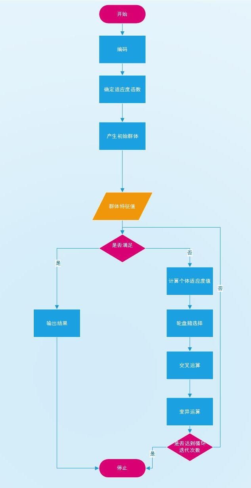
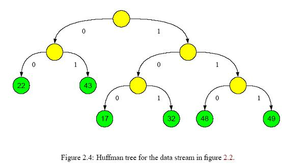

## 1. 问题定义

### 1.1 编写目的

- 明确定义该项目需要解决的问题
- 明确该项目的功能、用途
- 明确项目产品最终的使用流程
- 明确系统的基本架构

### 1.2 项目概述

目前各大城市有各大干快上地铁&轻轨项目 ,却极少有城市关注后续MRT站点地块开发情况;加之评估MRT地块开发耗时耗力,以上海市徐家汇站为例,调研该地块经济、居住、环境、交通、社会等可持续发展情况至少需要数月,再加上庞大的后续数据分析量, 非大半年无法完成。 希望能够通过开发这款软件，使得可以大大缩减采集数据后的漫长的分析时期，并加入时序数据，实现提高分析的准确度，去除冗余和干扰信息，减少采集数据工作量并提高分析运算速度，提供数据可视化的界面，从而为进一步实现“智慧城市”，让城市使生活更美好而贡献力量。

> MRT名词解释：大多数的城市轨道交通系统在城市中心的路段都会铺在地下挖掘的隧道里。这些系统亦可称为地下铁路，简称地下铁或地铁。在台湾、曼谷和新加坡则称作“捷运”(Mass Rapid Transit, MRT)。在中国大陆城市，修建于地上或高架桥上的城市轨道交通系统通常被称为“轻轨”。然而，在专业领域，“轻轨”与“地铁”的区分方式在于运量的不同，“轻轨”指每小时单向运输量小于20000人的城市轨道交通系统，而“地铁”指每小时单向运输量大于20000人的城市轨道交通系统。

### 1.3 项目背景

- 目前各大城市大干快上地铁&轻轨项目，却极少有城市关注后续MRT站点地块开发情况
- 评估MRT地块开发耗时耗力（以上海市徐家汇站为例，调研该地块经济、人居、环境、交通、社会等方面发展情况至少需 要数月，再加上庞大的后续数据分析量，非大半年无法完成）
- 政府想要了解枢纽中心地区的发展趋势与发展前景，需要一个完整的系统来服务于地区发展
- 此项目所涉及到的数据规模庞大，*遗传算法*作为求解大数据最优问题的解决方案，经过设计与优化能高效率地解决该问题

### 1.4 参考资料
1. 有限元分析（FEA）是对于结构力学分析迅速发展起来的一种现代计算方法。它是50年代首先在连续体力学领域--飞机结构静、动态特性分析中应用的一种有效的数值分析方法，随后很快广泛的应用于求解热传导、电磁场、流体力学等问题，有限元方法已经应用于水工、土建、桥梁、机械、电机、冶金、造船、飞机、导弹、宇航、核能、地震、物探、气象、渗流、水声、力学、物理学等，几乎所有的科学研究和工程技术领域。基于有限元分析（FEA）算法编制的软件，即所谓的有限元分析软件。通常，根据软件的适用范围，可以将之区分为专业有限元软件和大型通用有限元软件。实际上，经过了几十年的发展和完善，各种专用的和通用的有限元软件已经使有限元方法转化为社会生产力。常见通用有限元软件包括LUSAS,MSC.Nastran、Ansys、Abaqus、LMS-Samtech、Algor、Femap/NX Nastran、Hypermesh、COMSOL Multiphysics、FEPG等等。有限元软件应用领域非常广泛，可应用在机械制造、材料加工、航空航天、汽车、土木建筑、电子电器、国防军工、船舶、铁道、石化、能源和科学研究等各个领域
2. 徐家汇是上海的城市副中心之一, 已发展成为重要的商业中心及交通枢纽。 上海市徐家汇地铁站位于上海市徐汇区，为轨道交通1号线、9号线及11号线的三线换乘站点，地处徐家汇商业集群的中心要冲。该站点共有约20余个出入口，分别用于沟通连接该地块各主要文教区、住宅区与商业集聚区，人流量乃至居住密度都达到极高的水平，建筑规划也极具代表性，研究此站点的土地开发模式将有助于其他相关或相异站点的深入研究与对比，从而获得更具当代实用价值的研究结论。
3. 遗传算法(GA)是建立在自然选择和群体遗传学机理基础上的随机、迭代、进化、具有广泛适应性的搜索方法。
   这是一种新的全局优化搜索算法, 因其简单通用, 鲁棒性强, 适于并行处理, 已广泛应用于计算机科学、优化调度、运输问题、组合优化等领域。GA的应用包括函数优化、机器学习、神经网络等方面。作为一种搜索优化方法,GA也被用于解决工业、商业等领域的实际问题。在遗传算法中，首先对所要求解的问题进行量化，并用二进制编码，然后随机产生一组二进制数作为问题的初始解（称为群体），群体中的每个个体都是问题的一个解（称为染色体），这些染色体在之后的迭代中不断进化（称为遗传）。进化的过程主要通过交叉、变异、选择运算实现。交叉或变异运算生成下一代染色体(称为后代),这些染色体的好坏用适应度来衡量,根据适应度的大小从上一代和后代中选择一定数量的个体,作为下一代群体,再继续进化。这样经过若干代之后,算法收敛于最好的染色体, 它很可能就是问题的最优解或次优解。

### 1.5 项目目的

- 通过对规划问题算法的研究，选取遗传算法处理大量实际数据，最终实现通过向软件中链入MRT站点地块微元网格土地使用类型数据（采集自百度地图）、大批量问卷数据、时序数据等交通地理数据信息，通过后台程序计算，短时间内（短则数小时）便能计算出当时期该地块开发优势与不足，并能自动导出数个不同导向的具象化图示。
- 这套系统的价值，就在于能快速缩减采集数据后的漫长分析期，将原本需要近半年的工作量极速缩减到数天。 通过针对不同国度、不同地区、不同工况下的特别参数值，便可以获得较为精准与合理的分析结果。
- 最终开发的系统软件类似于Patran，Nastran的有限元分析软件（简版），用于分析集成的三项共计34项数 据点，最终分析出八项指标，以及3～4个液化模型的图例，用以呈现最终结果。

## 2. 系统概述

### 2.1 当前系统分析

- 第一部分：对MRT站点地块划分成N＊N的小微元区块，通过输入4N＊4N点矩阵阵列土地使用类型采样数据表，经过系统软件设定好的遗传算法及相关参数，分析该区块各类型建筑分布合理度，同时自动通过相关数据生成微元切割图、GIS元胞分析图等。分析时长可由传统算法的3个月缩短至3个小时。
- 第二部分：导入已输入电脑系统的大容量问卷样本数据（一般为Excel的xls文件&SPSS系统文件），通过 系统已经设定好的线性回归算法分析程序，快速迭代分析出结果属性值，同时自动生成问卷分布玫瑰图（形式参见地理学上的风向玫瑰图）。
- 第三部分：有上述两部分所得出的所有分析量化值，以及采集到的地块微元数据，配合大容量文件的样本数据，汇总综合生成“智慧城市MRT站点地块3D微元分析图”。

### 2.2 目标系统分析

- 在当前背景下，国内大中型城市城乡建设逐步扩大，原有的交通运输已经远不能满足现在的乘客运输需求。由此各地政府大力开展新型交通运输建设如公交、快运、地铁等。然而在建设交运线路和站点的时候，对建设地点的选取以及分析成为了关键性的问题，传统的分析方式在搜集数据后，至少要经过2，30十天的数据分析，这显然是不符政府需求的。
- 在这个背景下，我们决定革新数据分析算法，并开发数据可视化程序帮助交运方面专业人员能够在搜集数据后快速得到站点的评估数据。
- 由于数据量级在百万级，如在徐家汇地铁站的调查中，我们的元数据共1188组，迭代次数共2000次，计算量达到了3376000次，传统统计方法显然过于耗时，经过对问题的抽象，我们总结出目标问题实质上为动态规划问题，搜集的数据作为我们的决策变量，而对动态规划问题求最优解的算法共有：
  - 遗传算法：优点是能很好的处理约束，能很好的跳出局部最优，最终得到全局最优解，全局搜索能力强；缺点是收敛较慢，局部搜索能力较弱，运行时间长，且容易受参数的影响。遗传算法适合求解离散问题，具备数学理论支持，但是存在着汉明悬崖等问题。
  - 模拟退火：优点是局部搜索能力强，运行时间较短；缺点是全局搜索能力差，容易受参数的影响。
  - 爬山算法：显然爬山算法较简单，效率高，但是处理多约束大规模问题时力不从心，往往不能得到较好的解。
  - 粒子群算法适合求解实数问题，算法简单，计算方便，求解速度快，但是存在着陷入局部最优等问题。
  - 蚁群算法适合在图上搜索路径问题，计算开销会大。
- 由于本项目主要侧重在整体最优解的求解，并不考虑过多的局部搜索，综上分析，决定采用遗传算法来求解对地域的评估。
- 与此同时，数据的显示同样是传统交运分析中的难点，目前市场上并没有太多针对地图的可视化数据分析显示软件，所以在针对算法革新的同时，我们决定优化界面，采用各地段分色的策略显示数据。

### 2.3 产品使用流程图

概要说明：

- 此项目的使用者为政府的相关专业人员，用来专业地分析地区发展状况与发展前景
- 在给出已有数据的前提下，此系统能够快速地给出分析结果，省去大量的人力物力

## 3. 可行性研究报告

### 3.1 技术可行性

#### 3.1.1 数据搜集

- 数据搜集方式：

  - 传统问卷调查：此方式搜集到的数据主要用来产生遗传算法的初始群体
  - 获取百度地图对地域种类区分数据

- 百度提供了多种方式接入百度地图SDK如：LB.S云服务、Web服务API等

  > LBS.云是百度地图针对LBS开发者推出的平台级服务，结合已有的地图API和SDK服务，通过开放服务端	存储和计算能力，提供海量位置数据的实时存储、检索、展示一体化解决方案。
  >
  > 百度地图Web服务API为开发者提供http接口，即开发者通过http形式发起检索请求，获取返回json或xml格式的检索数据。用户可以基于此开发JavaScript、C#、C++、Java等语言的地图应用。

#### 3.1.2 数据处理
- 针对数据处理我们采用遗传算法，在可行性上，经调查有很多遗传算法的实例如：计算机作诗作曲，攻击神经网络，自动计算光源位置等，具备实际的可行性，而理论上遗传算法从90年代开始进入到了快速发展状态，前人已经做了很多工作来确保理论上可以实现算法
- 遗传算法的实现：本项目涉及到的公式、参数、变量繁多，在原有遗传算法的基础上需要一定程度的创新与改进。擅长后端处理数据的语言框架众多，例如python。但是项目处于初始阶段，为了验证方案的可行性，我们选用了数据处理能强大的MATLAB集成工具来编写实现我们设计算法，这有大大缩减了我们的第一阶段开发时间
- 前端可视化：作为数据展示的前端页面，也承担了与使用者交互的任务。我们现阶段准备做成一个简单的操作页面，功能包括导入数据，处理数据，展示数据，简单易行。

#### 3.1.3 数据展现

由于要展现的数据量大但精度不高，采用图形化展示可呈现直观感受，展示方面采用OPOA（OnePageOneApp)单页响应网页应用，确保使用用户可随时查看数据。而单页应用的编写基于新兴Vue.js的前端框架，保证了展现数据的可行性。实际情况下，采用Vue.js框架制作的网页应用已经上线很多如：

+ [MarkDown编辑器](http://cn.vuejs.org/v2/examples/index.html)
+ [SVG图表](http://cn.vuejs.org/v2/examples/svg.html)

等，具有实际操作的可行性。

### 3.2 经济可行性

- 经济层面上，在项目开发时所需求经济除了技术性报酬外，仅需服务器和云存储，额外花费几乎没有
- 而项目使用的经济需求主要在于对问卷数据的需求和百度WebAPI服务的费用，这些费用在与项目搭建成功后带来的大量人力与时间的节省相比微不足道
- 从经济上分析，城市建设部门投入更少的资本可带来比以往地段分析更清晰的数据评估，在建设时可避免很多弯路

### 3.3 社会可行性

从社会学角度分析，数据采集时不仅基于先有的固定数据，而是结合了针对用户居民的问卷调查结果，确保了项目的动态发展特性，确保通过时间推移项目依然具备一定得可行性实用性。

### 3.4 结论意见

- 经技术、经济、社会等多方面可行性分析，该项目具备开发潜力并具有实际开发意义。
- 但本项目涉及到的系统庞大复杂，开发人员还需要与政府进行合作，因此在第一阶段开发中自行找寻搜集以及模拟数据进行测试
- 在为期一个月的时间内能够完成核心算法的开发。

## 4. 需求分析

### 4.1 任务概述

#### 4.1.1 目标

- 软件用于采集轨交站点周围附近地块数据后自动分析结果并进行可视化的软件
- 分为数据导入、土地块微元切割与迭代计算、分析可视化显示三个模块

#### 4.1.2 数据导入
- 从百度地图导入给定区域地块的地理数据，以及搜集问卷调查居民反映的数据
- 数据输入格式为XML，要求文件输入，从WEB服务获取数据和数据输入要求异步进行确保程序运行的效率及流畅度。、
- 测试时可免费使用百度服务，投入运营后需百度授权
- 问卷数据搜集后如果基数不够可采用一定的模糊处理。

#### 4.1.3 微元切割与迭代运算

- 数据读入后，根据以下函数模型求出最大结果：
  - 最大化紧凑型目标函数： 
  - 最大化多样性目标函数：
  - 最大化商业可达性目标函数：
  - 相邻开发相容性目标函数：
- 其中参数说明：
  - i：土地单元编号，表示单元所处行
  - j ：土地单元编号，表示单元所处列
  - k ：土地使用类型
  - x ：决策变量，哑元变量，如果在单元 处为 种土地使用类型则为1，否则为0。（使用二进制为土地编码，保证了遗传算法的实现）
  - t ：决策变量，单元 处为 种土地使用类型的开发密度，如果为住宅，单位为户数/每单元；如果为商业、办公，单位为建筑面积/每单元
  - A ：单位u周围土地使用的紧凑程度，以该单元周边开发的单元数量作为衡量标准，即表示同等面积内，开发的项目越多，该地区就越紧凑，反之越松散
  - D ：单元u与车站之间的直线距离
  - S ：k类型单元 吸引的出行总量（商业、办公类）
  - C ：两种临近开发的冲突程度。
  - P ：经济类住房所占比例的上限和下限。
  - Q ：住宅类和商业办公类的总开发量限制。
  - M ：混合使用程度的最大限制。
  - q ：每个单元住宅类和商业办公类的开发密度限制。
  - a ：公共设施在总开发中所占的比例系数。
- 限制条件为：
  - 总量限制： 

  - 开发强度限制： 

  - 土地混合使用程度限制：

  - 政策性住房比例限制：

  - 公共设施最低要求：

#### 4.1.4 数据显示

须将分析得出的最优结果采用可视化的方式显示出来，显示方式为用12种颜色区分12种地块，并结合色深代表热点程度，做成如下图所示的热点图一张：

### 4.2 具体需求分析

#### 4.2.1 系统流程图

#### 4.2.2 数据流图

#### 4.2.3 遗传算法流程图

#### 4.2.4 数据字典

- 单元块表：
  - posx 横坐标 int 0<posx<36
  - posy 纵坐标 int 0<posy<36
  - type 土地类型 int 0~12
  - square 区块面积 double >0
  - x 决策土地类型 int 0~12
  - y 决策建设密度 double
- 土地数据：
- 居民调查数据表：
  - id int 居民编号
  - posx int 居民居住地块横坐标
  - posy int 居民居住地块纵坐标

### 4.3 支持信息

#### 4.3.1 运行环境

- Windows 10 x86 64位
- MacOS

#### 4.3.2 支持软件

- MATLAB

> MATLAB[1]  是美国MathWorks公司出品的商业数学软件，用于算法开发、数据可视化、数据分析以及数值计算的高级技术计算语言和交互式环境，主要包括MATLAB和Simulink两大部分。具有如下四个优势特点：
> 1) 高效的数值计算及符号计算功能，能使用户从繁杂的数学运算分析中解脱出来；
> 2) 具有完备的图形处理功能，实现计算结果和编程的可视化；
> 3) 友好的用户界面及接近数学表达式的自然化语言，使学者易于学习和掌握；
> 4) 功能丰富的应用工具箱(如信号处理工具箱、通信工具箱等) ，为用户提供了大量方便实用的处理工具。

- ARCGIS地理信息系统软件

> ArcGIS Online是Esri建设的公有云平台，也是第一个云GIS平台。它基于亚马逊的AWS和微软的Windows Azure搭建而成，为用户提供了一个基于云的、完整的协作式地理信息内容管理与分享的工作平台。它与ArcGIS其他的产品无缝集成，让用户能够通过各种端，包括：Web端、桌面端、移动端，来组织、访问和分享ArcGIS Online中的GIS资源服务。

### 4.4 需求分析总结

本产品目标用于开发辅助决策工具，而针对程序需求来讲，主要在于明确数据输入、数据处理、数据输出三方面。数据输入格式为11 * 12 * 9 组元数据，处理按照文档中的函数处理，输出图形化显示数据。

## 5. 概要设计说明书

### 5.1 引言

#### 5.1.1 编写目的

#### 5.1.2 背景与依据

#### 5.1.3 参考资料

### 5.1 核心算法

#### 5.1.1 数据输入

由于初始数据量大，不可能做到直接读入通过网络上传到服务器，我们讨论决定采用将原始数据XML文件转为二进制文件，再采用二进制文件压缩算法压缩后上传到服务器经服务器处理。

- XML转二进制算法：
  - 数据输入具有i,j,k,p四个字段（字段含义见[需求分析]()）
  - 考虑到数据位数以及数据范围，最终敲定对应位数如下：（每组数据共48位）
    - i----6位
    - j----6位
    - k----4位
    - p----32位

- 转换算法：为异步加载xml文件，读入的每条数据到内存，截取掉无用位数段后写入到二进制文件，释放掉内存，直到所有数据都完后关闭XML文件和二进制文件

- 压缩文件算法：

  - 选用*哈夫曼算法*

  - 简要解释：查找每个符号的通用程度，我们建立一个未压缩数据的柱状图；通过递归拆分这个柱状图为两部分来创建一个二叉树，每个递归的一半应该和另一半具有同样的权（权是∑NK =1符号数k, N是分之中符号的数量，符号数k是符号k出现的次数）编码器使用这棵树来找到每个符号最优的表示方法解码器使用这棵树唯一的标识在压缩流中每个编码的开始和结束，其通过在读压缩数据位的时候自顶向底的遍历树，选择基于数据流中的每个独立位的分支，一旦一个到达叶子节点，解码器知道一个完整的编码已经读出来了

  - 举例：根据符号频率，哈夫曼编码器生成哈夫曼树和相应的编码表示

    

    

    压缩后的数据流是24位（三个字节），原来是80位（10个字节）。当然，我应该存储哈夫曼树，这样解码器就能够解码出对应的压缩流了，这就使得该例子中的真正数据流比输入的流数据量大。这是相对较短的数据上的副作用。对于大数据量来说，上面的哈夫曼树就不占太多比例了

    

    解码的时候，从上到下遍历树，为压缩的流选择从左/右分支，每次碰到一个叶子节点的时候，就可以将对应的字节写到解压输出流中，然后再从根开始遍历。

    

  - 算法流程图：

    

#### 5.1.2 数据处理

- 采用遗传算法来进行最优搜索

  > 遗传算法（Genetic Algorithm）是模拟达尔文生物进化论的自然选择和遗传学机理的生物进化过程的计算模型，是一种通过模拟自然进化过程搜索最优解的方法。
  >
  > 遗传算法是从代表问题可能潜在的解集的一个种群（population）开始的，而一个种群则由经过基因（gene）编码的一定数目的个体(individual)组成。
  >
  > 每个个体实际上是染色体(chromosome)带有特征的实体。染色体作为遗传物质的主要载体，即多个基因的集合，其内部表现（即基因型）是某种基因组合，它决定了个体的形状的外部表现，如黑头发的特征是由染色体中控制这一特征的某种基因组合决定的。因此，在一开始需要实现从表现型到基因型的映射即编码工作。
  >
  > 由于仿照基因编码的工作很复杂，我们往往进行简化，如二进制编码，初代种群产生之后，按照适者生存和优胜劣汰的原理，逐代（generation）演化产生出越来越好的近似解，在每一代，根据问题域中个体的适应度（fitness）大小选择（selection）个体，并借助于自然遗传学的遗传算子（genetic operators）进行组合交叉（crossover）和变异（mutation），产生出代表新的解集的种群。
  >
  > 这个过程将导致种群像自然进化一样的后生代种群比前代更加适应于环境，末代种群中的最优个体经过解码（decoding），可以作为问题近似最优解。
  >
  > 对于一个求函数最大值的优化问题(求函数最小值也类同)，一般可以描述为下列数学规划模型：式中x为决策变量，式2-1为目标函数式，式2-2、2-3为约束条件，U是基本空间，R是U的子集。满足约束条件的解X称为可行解，集合R表示所有满足约束条件的解所组成的集合，称为可行解集合。
  >
  > 

- 遗传算法的基本运算过程如下：

  1. 初始化：设置进化代数计数器t=0，设置最大进化代数T，随机生成M个个体作为初始群体P(0)
  2. 个体评价：计算群体P(t)中各个个体的适应度
  3. 选择运算:将选择算子作用于群体。选择的目的是把优化的个体直接遗传到下一代或通过配对交叉产生新的个体再遗传到下一代。选择操作是建立在群体中个体的适应度评估基础上的
  4. 交叉运算：将交叉算子作用于群体。遗传算法中起核心作用的就是交叉算子
  5. 变异运算：将变异算子作用于群体。即是对群体中的个体串的某些基因座上的基因值作变动
  6. 群体P(t)经过选择、交叉、变异运算之后得到下一代群体P(t+1)
  7. 终止条件判断:若t=T,则以进化过程中所得到的具有最大适应度个体作为最优解输出，终止计算

- 算法举例：

  - 问题定义如下：求下述二元函数的最大值

  - 个体编码：

    遗传算法的运算对象是表示个体的符号串，所以必须把变量 x1, x2 编码为一种符号串。本题中，用无符号二进制整数来表示。因 x1, x2 为 0 ~ 7之间的整数，所以分别用3位无符号二进制整数来表示，将它们连接在一起所组成的6位无符号二进制数就形成了个体的基因型，表示一个可行解。例如，基因型 X＝101110 所对应的表现型是：x＝[ 5，6 ]。个体的表现型x和基因型X之间可通过编码和解码程序相互转换。

  - 初始群体的产生：

    遗传算法是对群体进行的进化操作，需要给其淮备一些表示起始搜索点的初始群体数据。本例中，群体规模的大小取为4，即群体由4个个体组成，每个个体可通过随机方法产生。如：011101，101011，011100，111001

  - 适应度汁算：

    遗传算法中以个体适应度的大小来评定各个个体的优劣程度，从而决定其遗传机会的大小。本例中，目标函数总取非负值，并且是以求函数最大值为优化目标，故可直接利用目标函数值作为个体的适应度。

  - 选择运算：

    选择运算(或称为复制运算)把当前群体中适应度较高的个体按某种规则或模型遗传到下一代群体中。一般要求适应度较高的个体将有更多的机会遗传到下一代群体中本例中，我们采用与适应度成正比的概率来确定各个个体复制到下一代群体中的数量。其具体操作过程是：

    - 先计算出群体中所有个体的适应度的总和  ?fi  ( i=1.2,…,M )

    - 其次计算出每个个体的相对适应度的大小 fi / ?fi ，它即为每个个体被遗传到下一代群体中的概率

    - 每个概率值组成一个区域，全部概率值之和为1

    - 最后再产生一个0到1之间的随机数，依据该随机数出现在上述哪一个概率区域内来确定各个个体被选中的次数

      

  - 交叉运算：

    交叉运算是遗传算法中产生新个体的主要操作过程，它以某一概率相互交换某两个个体之间的部分染色体。
    本例采用单点交叉的方法，其具体操作过程是：

    - 先对群体进行随机配对

    - 其次随机设置交叉点位置

    - 最后再相互交换配对染色体之间的部分基因

      

  - 变异运算：

    变异运算是对个体的某一个或某一些基因座上的基因值按某一较小的概率进行改变，它也是产生新个体的一种操作方法。

    本例中，我们采用基本位变异的方法来进行变异运算，其具体操作过程是：

    - 首先确定出各个个体的基因变异位置，下表所示为随机产生的变异点位置，其中的数字表示变异点设置在该基因座处

    - 然后依照某一概率将变异点的原有基因值取反

      

  - 对群体P(t)进行一轮选择、交叉、变异运算之后可得到新一代的群体p(t+1)

  - 从上表中可以看出，群体经过一代进化之后，其适应度的最大值、平均值都得到了明显的改进。事实上，这里已经找到了最佳个体“111111”

#### 5.1.3 数据输出

采用点阵模糊拼接的算法，取一定范围内的点值采用高斯模糊的做法求出模糊值，采用对应颜色基础值输出，再根据建设密度叠加相应的颜色强度，最终输出一张可视图。

### 5.2 系统总体架构设计

### 5.3 软件总体架构设计

#### 5.3.1 数据输入

##### 5.3.1.1 设计类图

##### 5.3.1.2 主要类说明
1. DataStream数据流类

   - 成员变量：

     - length：数据流的长度
     - type：数据流的编码格式
     - data：数据流
     - open_type：只读或读写
   - 函数方法：
     - open():新建一个数据流
     - virtual read():读入数据
     - virtual write():输出数据
     - close():关闭数据流并释放
2. InputDataStream输入数据流类
   - 继承DataStream，打开方式为只读
3. OutputDataStream输出数据流
   - 继承DataStream，打开方式为读写
4. Form输入表单类
   - 成员变量：
     - input_uis：包括多个数据输入的UI组件（与用户交互组件）
     - datas：用户输入的数据
   - 函数方法;
     - Bind()：将用户输入绑定到数据数组
     - Submit()：将数据提交
5. DataChanger数据格式修改器
   - 成员变量：
     - source_data:修改前数据
     - result_data:修改后数据
   - 函数方法：
     - read():读入数据
     - output():输出结果数据
     - virtual Format():将数据转码
     - virtual UnFormat()：将数据解码
6. FormatChanger转码器
   - 继承DataChanger数据格式修改器
7. PatchChanger压缩器
   - 继承DataChanger数据格式修改器
8. DataSend数据发送类
   - 成员变量：
     - source_data:原数据
     - router:发送的url
   - 函数方法：
     - Send():发送数据

##### 5.3.1.3 接口设计说明

1. 模块外接口：

   - 接口名：Bind()，绑定数据

     功能：将用户输入的数据绑定到模块内部

     参数：用户输入的数据

     返回值：无

   - 接口名：Submit()，提交数据

     功能：将输入的数据提交到服务器

     参数：无

     返回值：当前已提交的数据量

2. 模块内接口：

   - 接口名：InputStream::Open()

     功能：创建一个可存储已知数据的数据流，不可修改

     参数：数据长度，数据解码类型，数据

     返回值：InputStream实例

   - 接口名：InputStream::Close()

     功能：关闭一个数据流并释放内存

     参数：无

     返回值：无

   - 接口名：DataChanger::Read()

     功能：创建一个转码器，并进行转码

     参数：原数据

     返回值：DataChanger实例

   - 接口名：DataChanger::Output()

     功能：取出转码后的结果并释放内存

     参数：无

     返回值：转码后数据

   - 接口名：OutputStream::Open()

     功能：创建一个空的数据流对象，可以写入

     参数：数据类型

     返回值：OutputStream实例

   - 接口名：OutputStream::Write()

     功能：将数据写入到可写入的数据流中

     参数：数据，数据长度

     返回值：无

   - 接口名：OutputStream::Close()

     功能：关闭一个数据流，并释放内存

     参数：无

     返回值：无

   - 接口名：DataSend::Send()

     功能：向模块外部发送一段数据，以路由的方式

     参数：数据

     返回值：发送是否成功

##### 5.3.1.4 模块时序图

#### 5.3.2 数据处理

##### 5.3.2.1 设计类图

##### 5.3.2.2 模块时序图

##### 5.3.2.3 主要类说明

1. DataHundleInterface数据处理接口类

   数据处理模块对外的接口

   - 成员变量：
     - data:接收到的数据
   - 函数方法：
     - DataHundle():开始数据处理

2. Gold上帝类

   存储管理和控制每一代的群体

   - 成员变量：
     - groups:群体数组，存储每一代的群体数据
   - 函数方法：
     - InitGroup()：创建初代群体
     - StartSire():开始繁殖遗传

3. Group群体类

   遗传算法中的一代群体

   - 成员变量：
     - indivituals:群体中的全部个体的数组
     - generate:群体的代数
     - fitness:群体的适应度
     - type:群体的适应度目标类型标记
   - 函数方法：
     - SelectExcute():自然选择运算，在群体中按比例选择出适应的个体

4. Indivitual个体类

   遗传算法中群体中的个体

   - 成员变量：
     - pos_x:个体固定值，所处土地单元矩阵的横坐标
     - pos_y:个体固定值，所处土地单元矩阵的纵坐标
     - land_type:个体固定值，土地规划类型
     - is_meet_plan：个体表现型，是否满足规划类型
     - cons_density：个体表现型，建设密度
     - chromosome：个体对应的染色体
     - fitness:个体的适应度
   - 函数方法：
     - VaruteExcute()：变异运算，使个体的染色体发生随机的变异

5. chromosome染色体类

   遗传算法中个体所拥有的染色体

   - 成员变量：
     - gene：染色体的基因，以二进制编码存储
   - 函数方法：
     - GeneExpression()：基因表达，将基因转换成表现型

6. FitnessCalculate适应度计算类

   以特定的规则计算个体适应度

   - 成员变量：
     - rule：计算的规则
   - 函数方法：
     - Excute():计算适应度

##### 5.3.2.4 接口设计说明

1. 接口名：DataHundle()

   功能：开始处理数据

   参数：数据源文件

   返回值：输出数据

2. 接口名：Gold::getInstance()

   功能：获取上帝的单例，如果没有则新建

   参数：无

   返回值：Gold类实例

3. 接口名：Gold::InitGroups()

   功能：创建初始群体

   参数：数据源

   返回值：群体数量

4. 接口名：Gold::GenerateExcute()

   功能：开始遗传进化

   参数：遗传代数

   返回值：无

5. 接口名：Group::SelectExcute()

   功能：对群体进行一代的自然选择

   参数：无

   返回值：无

6. 接口名：Indivitual::VarationExcute()

   功能：对个体进行随机的变异计算

   参数：无

   返回值：无

7. 接口名：Chromosome::GeneExpression()

   功能：对染色体的基因表达，将二进制编码解析成决策变量

   参数：无

   返回值：无

8. 接口名：FitnessExcute()

   功能：根据规则计算个体的适应度

   参数：Inivitual实例

   返回值：适应度

#### 5.3.3 数据输出

##### 5.3.3.1 设计类图

##### 5.3.3.2 主要类设计说明

1. DataStream数据流类

   定义数据结构用以在内存中以流的形式存储数据

   - 成员变量：
     - length：数据流的长度
     - type：数据流的编码格式
     - data：数据流
     - open_type：只读或读写
   - 函数方法：
     - open():新建一个数据流
     - virtual read():读入数据
     - virtual write():输出数据
     - close():关闭数据流并释放

2. InputDataStream输入数据流类

   继承DataStream，打开方式为只读

3. OutputDataStream输出数据流

   继承DataStream，打开方式为读写

4. DataOutput数据输出类

   将结果数据以一定的格式输出到文件

   - 成员变量：
     - data_type：数据格式
     - data：输出的数据
     - data_length:数据长度
   - 函数方法：
     - Output():将数据输出

5. DataChanger数据格式修改器

   修改数据的存储格式

   - 成员变量：
     - source_data:修改前数据
     - result_data:修改后数据
   - 函数方法：
     - read():读入数据
     - output():输出结果数据
     - virtual Format():将数据转码
     - virtual UnFormat()：将数据解码

6. FormatChanger转码器

   继承DataChanger数据格式修改器

7. PatchChanger压缩器

   继承DataChanger数据格式修改器

8. ImageChanger图片转码器

   继承DataChanger数据格式修改器

9. DataReciver数据接收类

   接收数据

   - 成员变量：
     - data:收到的数据地址
     - router:本地路由信息
   - 函数方法：
     - StartListener():开始监听数据

##### 5.3.3.3 接口设计说明

- 模块外接口：

  1. 接口名：StartListener()，开始监听数据

     功能：开始监听数据，在停止前若收到了数据信息则绑定到数据地址上

     参数：监听时间（-1表示手动停止）

     返回值：无

  2. 接口名：DataOutput(),输出数据

     功能：向指定路径输出数据

     参数：路径

     返回值：无

- 模块内接口：

  1. 接口名：InputStream::Open()

     功能：创建一个可存储已知数据的数据流，不可修改

     参数：数据长度，数据解码类型，数据

     返回值：InputStream实例

  2. 接口名：InputStream::Close()

     功能：关闭一个数据流并释放内存

     参数：无

     返回值：无

  3. 接口名：DataChanger::Read()

     功能：创建一个转码器，并进行转码

     参数：原数据

     返回值：DataChanger实例

  4. 接口名：DataChanger::Output()

     功能：取出转码后的结果并释放内存

     参数：无

     返回值：转码后数据

  5. 接口名：OutputStream::Open()

     功能：创建一个空的数据流对象，可以写入

     参数：数据类型

     返回值：OutputStream实例

  6. 接口名：OutputStream::Write()

     功能：将数据写入到可写入的数据流中

     参数：数据，数据长度

     返回值：无

  7. 接口名：OutputStream::Close()

     功能：关闭一个数据流，并释放内存

     参数：无

     返回值：无

#### 5.3.4 异常处理设计

##### 5.3.4.1 数据输入

- 模块外异常：

  1. 绑定数据：

     用户输入需满足格式，不满足格式的输出是不被允许的

  2. 提交：

     输入表单类中的数据需满足格式，不满足格式需报错并清空数据重新输入

  3. 打开数据流：

     检查可用内存并确保有足够的内存存储数据，如不够，弹出内存不足提示，要求用户重选数据处理异步分割量

  4. 发送数据：

     与目标路由建立连接，若无法连接，报网络错误，若可连接无法发送数据，报服务器未开启监听

- 模块内部错误：（第一次迭代针对遇到Bug添加异常处理方法）

  1. 数据流访问冲突：

     创建数据流时，建立繁忙标志，阻止多次访问带来的访问冲突

  2. 转码器未及时释放：

     规定转码器的生命周期，在取出数据后自动释放

##### 5.3.4.1 数据处理

- 模块外异常

  1. 群体数据量不足：

     创建上帝时要求数据输入量足够，若不足，报群体数据量不足

  2. 数据输入格式不对引起数据异常

     解析数据时，若发现不符要求的异常数据，报数据格式错误

  3. 适应度计算规则无结果

     由规则输入不合理导致短时间内无法得到适应度，要求重新输入适应度规则

- 模块内错误

## 6. 详细设计说明书

### 6.1 引言

#### 6.1.1 编写目的

1. 在“概要设计说明书”的基础上进一步完善
2. 为开发人员明确软件系统结构中的每一个模块程序
3. 针对“概要说明书”中的“软件总体架构设计”进行详细地展开

#### 6.1.2 背景与依据

1. “概要设计说明书”已经完成，总体概要已经明确
2. 需要对软件架构中的具体细节进行深入地讨论研究

#### 6.1.3 参考资料

### 6.2 系统软件结构

#### 6.2.1 用例

#### 6.2.2 架构

#### 6.2.3 时序

### 6.3 数据输入模块设计说明

#### 6.3.1 程序描述

#### 6.3.2 功能

#### 6.3.3 性能

### 6.4 数据处理模块设计说明

### 6.5 数据输出模块设计说明

