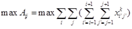
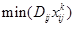
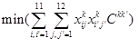

# 数据处理模块

## 系统架构

架构图

### 初始化模块

类图

生命周期图

#### 接口详细设计

接口名：InitGroup(),初始化群体

功能：以传入的数据为基础，产生初始群体

参数：满足格式的二进制数据

返回值：group的实例

算法描述：

+ 创建group类的实例g，代数为1
+ 执行以下循环，次数为数据长度 / 48
  + 创建inivitual个体类实例t
  + 为t添加染色体成员
  + 复制原数据的i-i+47位为d
  + 取d的前6位，解析为int，复制给t的i成员变量
  + 取d的6-11位，解析为int，复制给t的j成员变量
  + 取d的12-15位，解析为int，复制给t的成员变量k
  + 取d的16-27位，并随即产生一个0或1，合并作为给染色体的数据
  + 执行基因表达模块的表达接口
  + 将实例加入g的inivituals数组
+ 返回group实例

接口流程：

### 遗传繁殖模块

类图

生命周期图

#### 接口详细设计

接口名：Group::SelectExcute()

功能：对群体进行一代的自然选择

参数：无

返回值：无

算法描述：

+ 计算出群体内所有个体的适应度总和
+ 创建数组a，大小为适应度总和大小
+ 定义临时指针p,指向数组a的首地址
+ 遍历个体
  + 设个体适应度为t
  + 令p-p+t的a数组中的值为该个体的索引
+ 创建一个空的群体n，群体代数为当前代数加一
+ 执行以下循环，次数为个体个数
  + 产生一个0~个体适应度总和-1的随机数
  + 获得a数组中随机数位置的个体索引
  + 将对应个体复制并添加到新群体n中
+ 标记当前群体为群体n

接口流程：

接口名：接口名：Indivitual::VarationExcute()

功能：对个体进行随机的变异计算

参数：无

返回值：无

算法描述：

+ 产生一个0-32之间的随机数x
+ 产生一个0~100的随机数p
+ 如果p<预定的变异概率 * 100则返回
+ 对个体的染色体的数据第x位取反
+ 执行基因表达模块的表达函数
+ 返回

接口流程：

接口名：ChangeExcute()

功能，对群体中的个体进行染色体基因交叉，模拟自然界个体生育繁殖

参数：无

返回值：无

算法描述：

+ 创建一个包含所有个体索引的链表
+ 执行以下循环，直到链表内节点数为0
  + 取出首节点，随机生成一个1~链表剩余节点数的随机数，取出链表中对应位置的节点
  + 随机产生一个0~32的随机数
  + 令取出的两个个体索引对应的个体交换对应位置的基因
  + 执行基因表达模块的表达函数
+ 返回

接口流程：

### 预估判断模块

类图

生命周期图

#### 接口详细设计

接口名：FitnessExcute()

功能：根据规则计算个体的适应度

参数：Inivitual实例

返回值：适应度

算法描述：

+ 通过输入值获得规则，规则可以为以下四个
  + 
  + 
  + 
  + 
+ x,k,i,j为个体的成员变量，计算的得出适应度，复制给成员变量
+ 返回

### 基因表达模块

类图

生命周期图

#### 接口详细设计

接口名：Chromosome::GeneExpression()

功能：对染色体的基因表达，将二进制编码解析成决策变量

参数：无

返回值：无

算法描述：

+ 获取基因数据的第一位，按值转为int值，赋值给个体成员变量x
+ 获取基因数据的1~32位，转为float，赋值给个体成员变量p
+ 返回

### 系统执行逻辑接口

接口名：DataHundle()

功能：开始处理数据

参数：数据源文件

返回值：输出数据

算法描述：

+ 执行Gold::getInstance()
+ 执行Gold::InitGroup()
+ 执行Gold::GenerateExcute()
+ 等待遗传进化执行结束

接口流程：

接口名：Gold::getInstance()

功能：获取上帝的单例，如果没有则新建

参数：无

返回值：Gold类实例

算法说明：

+ 判断成员变量instance是否为null
+ 如果为null，创建一个新的Gold类，赋值给instance，返回instance
+ 如果非空，则返回instance

接口名：Gold::GenerateExcute()

功能：开始遗传进化

参数：遗传代数

返回值：无

算法描述：

+ 如果group为空则返回

+ 执行以下循环，次数为循环代数
  + 对当前群体执行SelectExcute()
  + 对当前群体执行ChangeExcute()
  + 对当前群体每个个体执行VarationExcute()
  + 将当前群体输出到文件
+ 循环结束后将文件输出到数据输出模块

接口流程：

