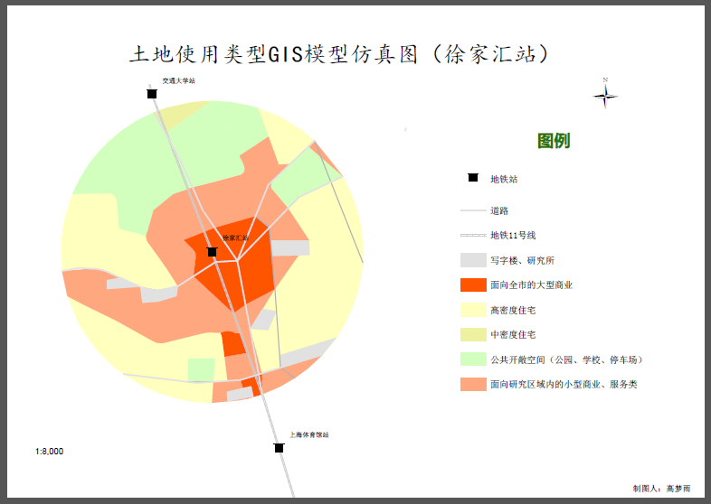

# 软件测试

## 实验地点
###上海市徐家汇地铁站
徐家汇是上海的城市副中心之一, 已发展成为重要的商业中心及交通枢纽。 上海市徐家汇地铁站位于上海市徐汇区，为轨道交通1号线、9号线及11号线的三线换乘站点，地处徐家汇商业集群的中心要冲。该站点共有约20余个出入口，分别用于沟通连接该地块各主要文教区、住宅区与商业集聚区，人流量乃至居住密度都达到极高的水平，建筑规划也极具代表性，研究此站点的土地开发模式将有助于其他相关或相异站点的深入研究与对比，从而获得更具当代实用价值的研究结论。

##土地类型规定
###术语解释
TOD模型理论
TOD策略发展模式是指随着社区理论的发展以及现代轨道交通技术的革新，通过居住、商业和办公等用地与公交设施的有效整合，形成符合城市公交发展的土地利用结构的一种城市空间增长模式。

根据TOD规划模型理论，研究范围是以站点为圆心，步行10～15分钟的圆周地域；而依照中国国情，研究的范围最终定在以徐家汇站中心为原点，方圆800米的圆形地域。该地域根据实际情况，又以11*12个方形区块组成的矩形阵地域进行逼近仿真，每个方形区域再细分成3*3的单元阵列，用以计算该区域土地类型分布矩阵。每块方形区域为50m*50m。
土地类型则采用了14级划分法，从0～13分别代表14种不同类型的土地类型分布，用以形成22*24的土地类型矩形分布阵列，从而使用遗传算法进行迭代运算分析，得出该地块土地类型规划建设参数值，继而用于实际分析。

0	未开发土地
1	低密度住宅
2	中密度住宅
3	高密度住宅
4	政策性保障住房
5	面向研究区域内的小型商业、服务类
6	面向全市的大型商业
7	写字楼、研究所等
8	公共开敞空间（公园 、学校、停车场）
9	不开发土地
10	工业（主要制造业）
11	城中村住房
12	道路
13	开发区域外部

##模型求解
使用遗传算法进行模型求解（32基于土地类型的二进制编码方法）。染色体数量共有1188个。

##结果

可视化图

结果值

紧凑性目标函数值    -1.177000 

多样性目标函数值   -0.758133
商业可达性目标函数值 0.129319 
相容性目标函数值   7.965700 

结果分析

由四项迭代量化值可以看出，紧凑性目标与多样性呈现负值，而商业可达性及相容性目标呈现正值，且相容性目标达到一个较高的值水平。

    分析可知，徐家汇站点地块可待开发土地异常稀缺，目前TOD模型范围内（即直径800m范围区域）可留作开发的用地仅剩余两处，分别位于港汇恒隆广场西侧与中原新村南侧，但两者总面积也不足三个篮球场。故此站点地块土地开发已接近饱和，难以新建更多高密度住宅区或大型商业集群，且因徐汇区为老城区，比邻徐家汇公园，故地块中旧式低密度住宅区和城中村建筑仍占据较高比例，相应的商业集群则较多集中在地铁站核心区域，外围区域的商业分布则较为分散与稀少。紧凑性与多样性的低值分布则正是反映了这一情况。

    尽管由于地铁站点对商业集群的极高吸附性造成商业集群分布不均，但徐家汇站繁忙而复杂的公交-地铁接驳系统，在一定程度上缓解了这一问题。良好的短途公交系统成功地将居民从地铁商业集群与居住区往复运输，加之徐家汇地区是上海第二大商业集群地带，故反映在商业可达性上即为正值。

    最后在相容性指标上呈现了极高的正值，一方面是由于徐家汇站在后期换乘线路规划时，配合使用TOD理论进行了合理的规划建设，另一方面也得益于快速且发达的地铁-公交转运系统与该地区发达的立交桥快速交通系统，使得原有封闭发展的地块打破格局，获得开放式的融合发展。